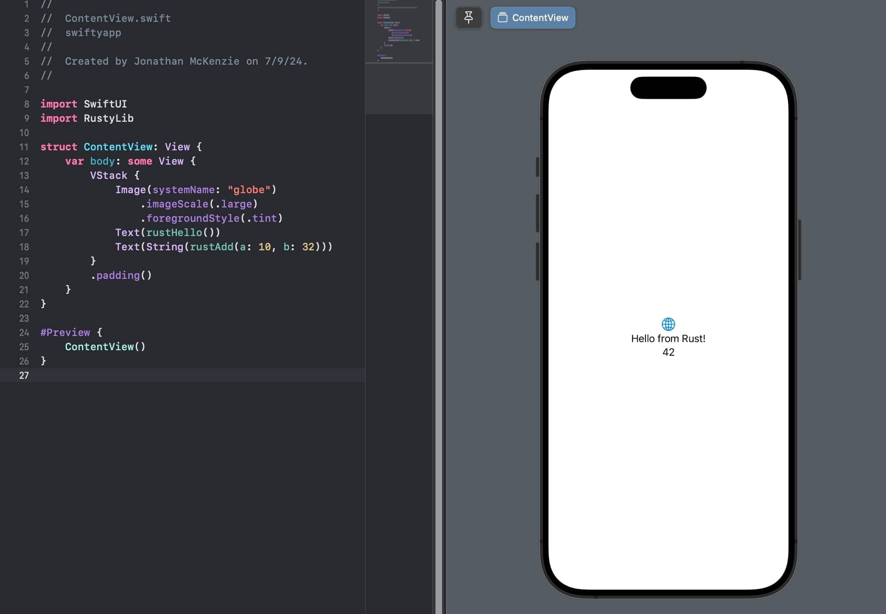

# xcode-rust-example

Demonstrates the ability to generate the necessary bindings for a rust lib compiled for an apple target to be embedded and called by a Swift project in Xcode.

## Setup

`rustylib` rust library with two exposed functions  
`swiftyapp` hello world ios app that imports and uses the two rust lib functions

1. Run `build.sh`
1. Open the Xcode project located at `swiftyapp/swiftyapp.xcodeproj`.
1. Build and run the project in Xcode.
1. Verify that the Rust library functions are successfully called from the Swift project.

### Referenced Articles:  
- https://boehs.org/node/uniffi
- https://forgen.tech/en/blog/post/building-an-ios-app-with-rust-using-uniffi
- https://krirogn.dev/blog/integrate-rust-in-ios#make-the-library

